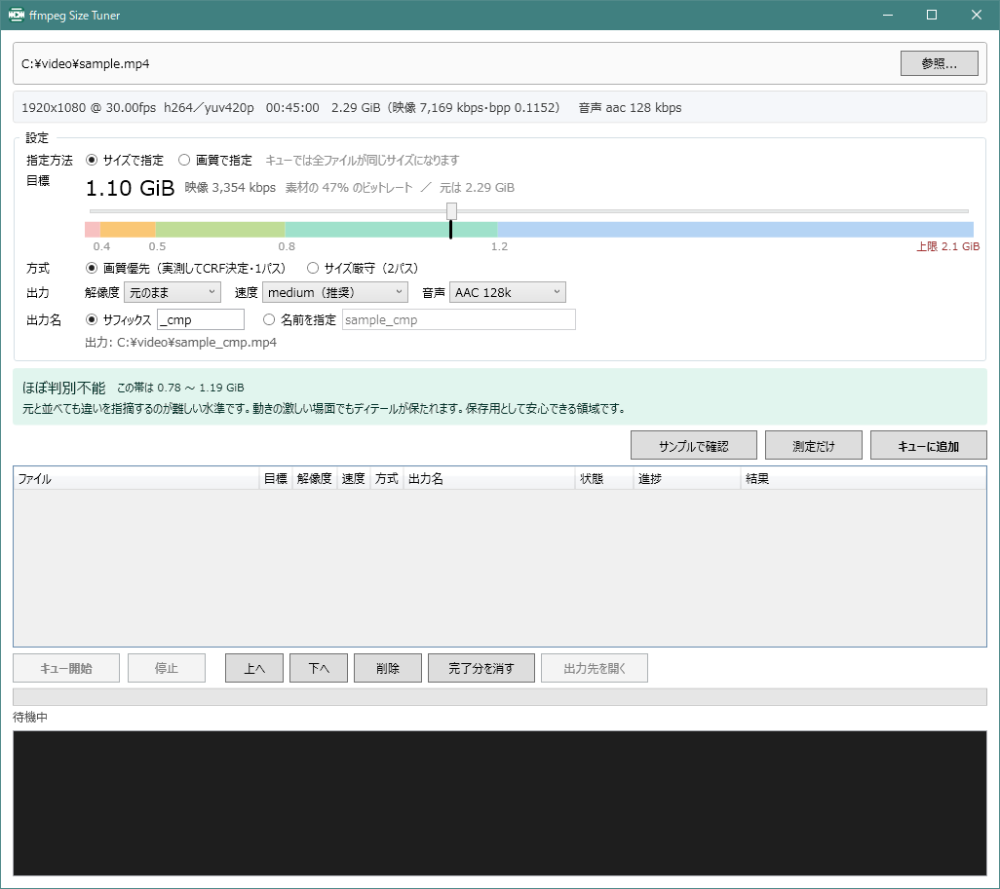
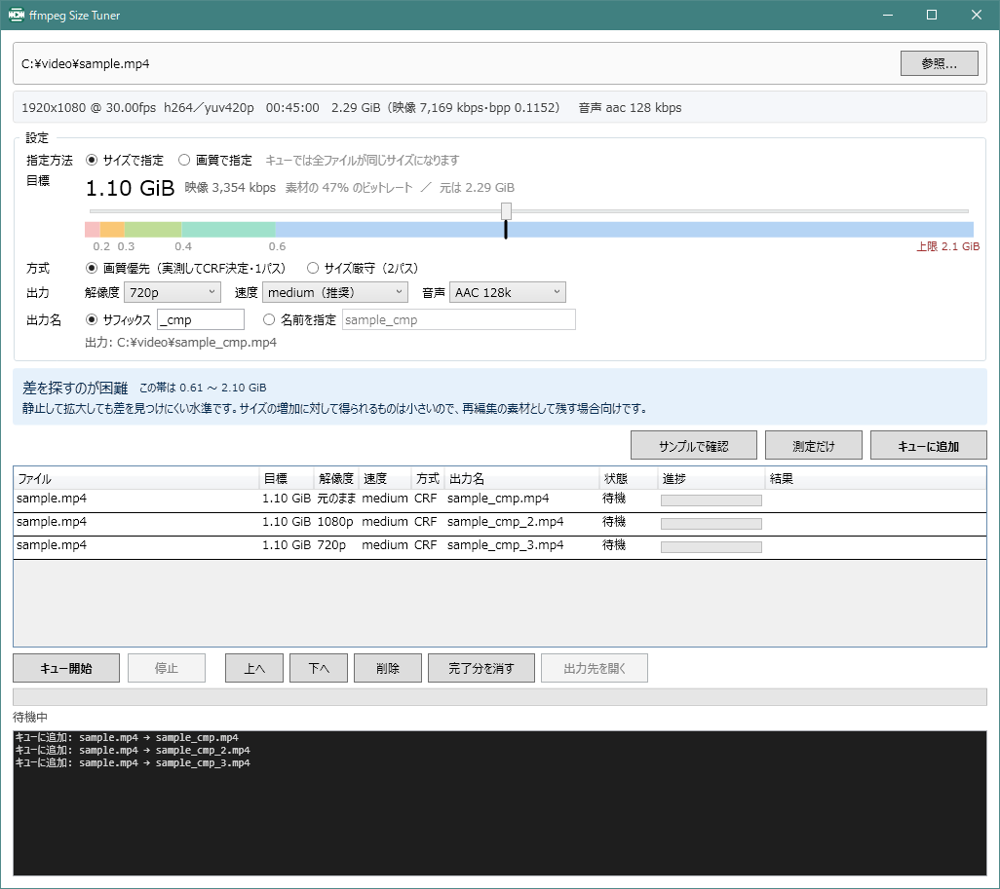

# ffmpeg Size Tuner

動画を x265 で「狙ったサイズ / 狙った画質」に圧縮する Windows アプリ。

CRF は品質を一定に保つモードなので、出力サイズは素材の複雑さ次第で 2 倍以上ブレる。
このツールは**素材そのものを数箇所だけ試し焼きして** CRF ↔ ビットレートの関係を実測し、
目標に一致する CRF を逆算する。複数ファイルをキューに積み、ファイルごとの設定で順に処理できる。



## 必要なもの

- `ffmpeg` / `ffprobe` が PATH にあること（libx265 が有効なビルド）
- [.NET 10 Desktop Runtime](https://dotnet.microsoft.com/download/dotnet/10.0)
- ビルドするなら .NET 10 SDK

## ビルドと実行

```powershell
dotnet build

dotnet publish FfmpegSizeTuner.App -c Release -r win-x64 --self-contained false `
  -p:PublishSingleFile=true -o publish
```

`publish\FfmpegSizeTuner.exe` が単一ファイル（約 310KB）で出る。実行には .NET 10
Desktop Runtime が要る。ランタイムごと同梱するなら `--self-contained true`（約 90MB）。

## 使い方

1. 動画をドラッグ & ドロップ（**複数まとめてドロップすると現在の設定でキューに直接入る**）。
   `FfmpegSizeTuner.exe <動画のパス>` でも開けるので、エクスプローラの「プログラムから開く」に
   登録しておくとよい
2. スライダーで目標を決める
3. 必要なら「**サンプルで確認**」— 試し焼きして CRF を確定し、本番と同一設定の
   30 秒サンプルを作って再生する
4. 「**キューに追加**」— その時点の設定を丸ごと固定して 1 行追加。サンプル確認済みなら
   CRF も引き継ぐので試し焼きが省ける
5. 「**キュー開始**」— 上から順に処理。停止も可

## 目標の指定

つまみは **1 本だけ**で、**0.10 GiB 刻み**。動かすと下の色帯上の位置が変わり、
**到達する画質の説明**が切り替わる。bpp のような数値を理解する必要はない。

```
目標  ● サイズで指定  ○ 画質で指定     キューでは全ファイルが同じサイズになります

      1.80 GiB   映像 2,409 kbps   素材の 43% のビットレート ／ 元は 4.14 GiB
      ├────────────────●──────────────────┤
      ▓▓▓░░░▒▒▒▒▒▒▓▓▓▓▓▓▓▓▓▓▓▓▓░░░░░░░░░░░░░░░░░░░
        0.8  1.0    1.5        2.2          上限 3.9 GiB

      ┌────────────────────────────────────────────┐
      │ ほぼ判別不能        この帯は 1.48 〜 2.25 GiB │
      │ 元と並べても違いを指摘するのが難しい水準です。動きの │
      │ 激しい場面でもディテールが保たれます。保存用として   │
      │ 安心できる領域です。                          │
      └────────────────────────────────────────────┘
```

スライダーの範囲は素材ごとに決まる。下端は実用外の手前、**上端は素材の映像
ビットレートの 95%**（それ以上は情報が増えないため、赤字で表示される）。

`サイズで指定` と `画質で指定` はどちらも同じつまみを動かす。違いは
**キューに入れたときに何が固定されるか**だけ。

| | キューでの挙動 |
|---|---|
| サイズで指定 | 尺が違っても全ファイルが同じサイズになる |
| 画質で指定 | 尺が違っても全ファイルが同じ画質になる（サイズは尺に比例する） |

### 画質の帯

境界は正規化 bpp（720p/30fps 基準）で、**実写動画を前提に置いている**。
アニメや CG は平坦な面が多く圧縮が効くため、同じ体感でもこれより下に来る。

| 正規化 bpp | 帯 | 説明 |
|---|---|---|
| 〜0.022 | 明確に劣化 | 暗いシーンや動きの速い場面でブロック状のノイズが出る。肌や髪の細部が溶け、背景の質感が失われる。保存用には向かない |
| 0.022〜0.028 | 劣化が見えやすい | 静かな場面は問題ないが、カメラが動く場面や暗部で細部が甘くなる。一度見返す程度なら実用範囲 |
| 0.028〜0.042 | 実用十分 | 通常の視聴では気にならない。元と並べると細かい質感やグレインにわずかな差 |
| 0.042〜0.065 | ほぼ判別不能 | 元と並べても違いを指摘するのが難しい。動きの激しい場面でもディテールが保たれる。保存用として安心できる |
| 0.065〜 | 差を探すのが困難 | 静止して拡大しても差を見つけにくい。サイズ増加に対する見返りは小さい |

同じ帯の中にも幅がある点が重要で、たとえば 1080p25 で 1 時間 42 分の素材なら
「ほぼ判別不能」帯は 1.48 〜 2.25 GiB にあたる。0.77 GiB の差があるので、
帯を選ぶのではなくスライダーで詰める価値がある。

## キュー

各行は「ファイル / 目標 / 解像度 / 速度 / 方式 / 出力名 / 状態 / 進捗 / 結果」を表示する。
上へ・下へで順序変更、削除、完了分の一括削除ができる。

各行は**追加した時点の設定を丸ごと抱える**ので、ファイルごとに目標サイズも解像度も変えられる。
出力先は追加した時点で確保するため、同じ素材を設定違いで積んでも名前が衝突しない。



上の例は同じ素材を解像度だけ変えて 3 通り積んだところ。出力名が `_cmp` / `_cmp_2` / `_cmp_3`
と自動で分かれている。

## 出力ファイル名

出力先は**常に素材と同じフォルダ**。名前の付け方は 2 方式から選べる。

| 方式 | 入力 | 結果 |
|---|---|---|
| サフィックス | `_cmp` | `movie_cmp.mp4` |
| サフィックス | `_1080p_x265` | `movie_1080p_x265.mp4` |
| 名前を指定 | `my movie 2026` | `my movie 2026.mp4` |

- ファイル名に使えない文字（`\ / : * ? " < > |`）は自動で除去される
- `.mp4` など拡張子を打っても無視される（常に `.mp4` で出力）
- **同名ファイルがあれば `_2`, `_3` と連番になり、既存ファイルを上書きすることは絶対にない**
- 設定欄の下に実際の出力パスが常時プレビュー表示され、連番になる場合はその旨も出る

## 方式の違い

| | 画質優先（capped CRF） | サイズ厳守（2 パス ABR） |
|---|---|---|
| サイズ精度 | 上限は守るが下振れあり（実測例 −4〜+11%） | ±3%（実測例 −0.4%） |
| 画質配分 | シーンごとに最適配分。簡単な場面は自動で小さくなる | 目標を使い切る |
| 試し焼き | 必要 | 不要 |
| 本番時間 | 1 回 | 約 2 倍 |

## エンコード速度

preset を上げるほど時間がかかり、同じ CRF での出力は小さくなる。`slow` の利得は
`medium` に対して同 CRF で 8〜12% 程度だが、所要時間は倍以上になる。長尺の実写なら
`medium` が時間対効果で妥当なことが多い。

所要時間は環境と素材で決まるので、実測で判断するのが早い。進捗表示に出る速度倍率
（`1.25x` など）と残り時間がそのまま目安になる。試し焼きの段階で倍率が見えるため、
本番を始める前に見当がつく。

## 計算の根拠

**bpp（1 ピクセルあたりビット数）** を品質の共通尺度に使う。

```
bpp = 映像ビットレート(bps) / (幅 × 高さ × fps)
総ビットレート(kbps) = 目標サイズ(GiB) × 8,589,935 ÷ 秒数
```

解像度や fps が違う素材を同じ尺度で比べるため、bpp は 720p/30fps 基準に正規化する。

- **解像度効率** — 高解像度ほど同じ体感画質に必要な bpp は下がる。720p を 1.00 として
  1080p ×0.90 / 1440p ×0.83 / 2160p ×0.75
- **フレームレート** — 40fps 超はフレーム間相関が高いので ×0.70
- **コデック効率** — h264 → x265 で同画質が約 ×0.65（av1 ×1.25 / vp9 ×1.05 / hevc ×1.00）

CRF ↔ ビットレートは `log(bitrate)` が CRF に対してほぼ線形。2 点測れば傾きが決まり、
任意の目標ビットレートに対応する CRF が逆算できる。実測では **CRF +1 で約 12%、
CRF +6 で約 54% 減**（x265 の理論値どおり）。逆算値が試し焼きの範囲から離れても、
確認焼きが目標付近で実測を取り直して再補正するので精度は保たれる。

## テスト

```powershell
dotnet run --project FfmpegSizeTuner.Tests                 # 単体 64 件（ffmpeg 不要）
dotnet run --project FfmpegSizeTuner.Tests -- <動画のパス>  # 結合 24 件（実エンコードを含む）
```

結合試験は ffprobe の解析、プラン組み立て、クランプ、試し焼きから CRF 逆算、サンプル生成、
capped CRF と 2 パスの本番エンコード、一時ファイルの後始末、異常系までを実際に走らせる。
数分かかり CPU を使い切るので、他のエンコードと並行させないこと。

## 構成

```
FfmpegSizeTuner.Core/     計算とプロセス実行（UI 非依存・net10.0）
├ BitrateModel.cs         bpp / サイズ / CRF 回帰 / 画質の帯
├ QualityBand.cs          帯の定義と目標サイズスライダーの目盛り
├ OutputNaming.cs         出力名と連番
├ MediaInfo.cs            素材情報
├ MediaProbe.cs           ffprobe
├ ProcessRunner.cs        外部プロセス（ArgumentList で自動クォート）
├ Ffmpeg.cs               ffmpeg 実行と進捗（-progress pipe:1 を読む）
├ EncodeSettings.cs       画面の設定
├ EncodePlan.cs           確定した数値一式
├ FfmpegArgs.cs           引数組み立て
└ EncodePipeline.cs       試し焼き→逆算→確認→本番

FfmpegSizeTuner.App/      WPF（net10.0-windows）
FfmpegSizeTuner.Tests/    検証ハーネス
```

## 制限と既知の事項

- **10bit 素材**: x265 も自動で 10bit (Main10) 出力になる（素材情報欄に表示される）。
  再生互換を優先するなら `FfmpegArgs.cs` で `-pix_fmt yuv420p` を足す。
- **mkv 等**: 音声ビットレートが取れないコンテナでは bpp が実際より高めに出る。
- **画質の客観測定は未実装**: SSIM / PSNR / VMAF による検証は入れていない。
  必要になったら `EncodePipeline` に足す（ffmpeg の `ssim` / `psnr` フィルタは追加物なしで
  動く。`libvmaf` は別途モデル json が要る）。
